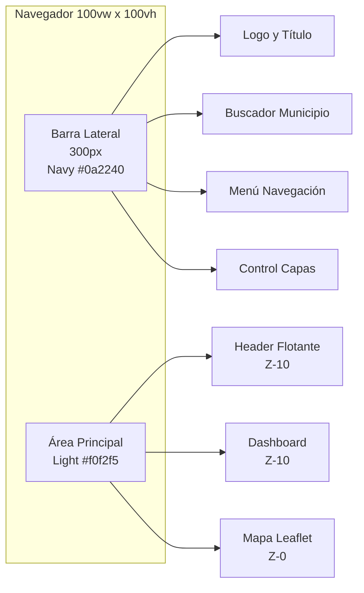
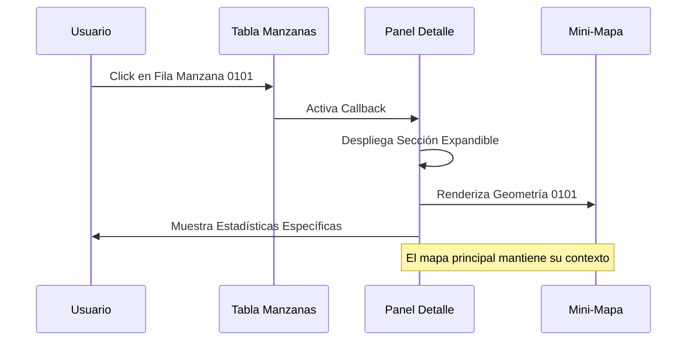
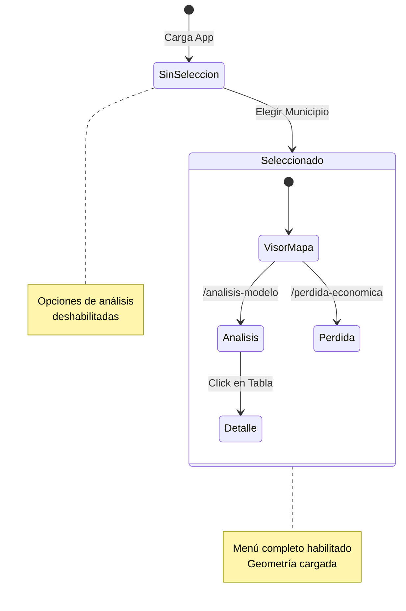

# Guía de UX y Maquetado - Visor Cartográfico

Este documento define las directrices de Diseño de Experiencia de Usuario (UX), la interfaz visual (UI) y la estructura de maquetado del **Visor Cartográfico**.

---

## 1. Concepto Visual

La aplicación sigue una filosofía de diseño **"Data-Centric Premium"**. El objetivo es presentar grandes volúmenes de información técnica (geográfica y estadística) de una manera limpia, moderna y accesible, inspirada en dashboards ejecutivos de alto nivel.

### Principios Clave:

* **Claridad**: La jerarquía visual debe guiar al ojo hacia los datos más importantes (KPIs) primero.
* **Profundidad (Layering)**: Se utiliza el concepto de capas superpuestas sobre el mapa. Los paneles de control flotan sobre la cartografía, utilizando sombras y efectos de desenfoque.
* **Feedback Inmediato**: Cada interacción (hover, click, selección) debe tener una respuesta visual instantánea.

---

## 2. Sistema de Diseño (Design System)

### 2.1. Paleta de Colores Corporativa

Se utilizan colores institucionales sobrios con acentos vibrantes para resaltar la interactividad.

* **Primario (Navy)**: `#0a2240` - Usado en barras laterales, textos principales y encabezados. Transmite solidez y confianza.
* **Secundario (Gold/Accent)**: `#f5c800` - Usado para bordes activos, botones de acción y resaltados en gráficos. Aporta contraste y energía.
* **Fondos**:
  * *App Background*: `#f0f2f5` (Gris muy claro) para áreas de contenido.
  * *Card Background*: `#ffffff` (Blanco puro) para tarjetas de datos.
  * *Glass Overlay*: `rgba(255, 255, 255, 0.8)` con `backdrop-filter: blur(10px)`.
* **Estados**:
  * *Success*: `#10b981` (Verde esmeralda).
  * *Warning*: `#f59e0b` (Ámbar).
  * *Error*: `#ef4444` (Rojo).
  * *Info*: `#0d6efd` (Azul corporativo brillante).

### 2.2. Tipografía

Se utiliza la familia tipográfica **Poppins** (Google Fonts).

* **Encabezados (H1, H2, Cards)**: `Poppins`, Weight 700 (Bold). Estilo moderno y geométrico.
* **Cuerpo y Tablas**: `Poppins`, Weight 400 (Regular) y 500 (Medium). Alta legibilidad en tamaños pequeños.
* **Números/Datos**: `Poppins`, Weight 600/700. Monospaced tabular implícito para alineación de cifras.

### 2.3. Espaciado y Grid

* **Sistema de 8px**: Todos los márgenes y paddings son múltiplos de 8px (8, 16, 24, 32, 48, 64).
* **Grid Bootstrap**: Sistema de 12 columnas con breakpoints estándar.
* **Contenedor Máximo**: 1400px para contenido principal (centrado).

---

## 3. Estructura de Maquetado (Layout)

La aplicación utiliza un layout híbrido que combina un mapa de fondo persistente con vistas de tablero superpuestas.

### 3.1. Zonas Principales

1. **Sidebar (Barra Lateral Izquierda)**

   * *Ancho*: Fijo (~300px en escritorio).
   * *Comportamiento*: Colapsable en móviles ("Hamburger menu").
   * *Contenido*: Selectores de municipio (Dropdowns), Navegación principal (Links), Filtros de capas del mapa.
   * *Estilo*: Fondo oscuro (`#0a2240`) o claro según el contexto, con scroll independiente.
2. **Lienzo del Mapa (Full Viewport)**

   * *Posición*: `z-index: 0`. Ocupa el 100% de la pantalla (`100vh`, `100vw`).
   * *Función*: Contexto geográfico siempre presente. Sirve de fondo visual sutil cuando se está en un tablero de datos.
3. **Área de Contenido / Overlay (Dashboard)**

   * *Posición*: `z-index: 10`. Superpuesta al mapa (excepto en la vista de "Visor Mapa").
   * *Estilo*: Contenedor con fondo opaco/semitransparente que aloja las tarjetas de análisis.
   * *Estructura Interna*: Grid system (basado en Bootstrap) de 12 columnas.
4. **Header Flotante**

   * Barra superior (en vistas de análisis) con título del municipio y breadcrumbs.
   * Diseño con gradiente y sombra suave (`box-shadow`) para separarlo del contenido.

### 3.2. Responsive Design (Adaptabilidad)

| Breakpoint           | Ancho      | Sidebar    | Columnas KPI | Gráficos  |
| -------------------- | ---------- | ---------- | ------------ | ---------- |
| **Móvil**     | <768px     | Offcanvas  | 1 columna    | Apilados   |
| **Tablet**     | 768-1199px | Colapsable | 2 columnas   | 2 columnas |
| **Escritorio** | >1200px    | Expandido  | 3 columnas   | 2 columnas |

**Consideraciones Móviles:**

* Sidebar oculto por defecto (Offcanvas toggle).
* Columnas de datos apiladas (1 columna).
* Tablas con scroll horizontal (`overflow-x: auto`).
* Mapas interactivos desactivan el scroll de página para evitar conflictos gestuales.

---

## 4. Componentes de Interfaz

### 4.1. Tarjetas KPI (Stat Cards)

* **Diseño**: Rectángulos con bordes redondeados (`border-radius: 16px`).
* **Contenido**:
  * Icono circular a la izquierda (64px × 64px).
  * Título (label) pequeño arriba en mayúsculas.
  * Valor grande central (1.8rem, bold).
  * Descripción explicativa debajo.
* **Interacción**: Efecto de elevación al pasar el mouse (`transform: translateY(-5px)`).
* **Sombra**: `box-shadow: 0 4px 6px -1px rgba(0, 0, 0, 0.05)`.

### 4.2. Tablas de Datos

* **Estilo Visual**: "Clean table". Sin bordes verticales, solo líneas horizontales separadoras.
* **Data Bars**: Barras de progreso integradas en las celdas para visualizar porcentajes sin leer números.
* **Sticky Headers**: Encabezados fijos al hacer scroll en tablas largas.
* **Heatmaps**: Celdas con fondo de color condicional (azul claro a oscuro) según la magnitud del valor.
* **Interactividad**: Ordenamiento multi-columna, filtrado nativo, paginación.

### 4.3. Gráficos

* **Tipo Principal**: Barras horizontales con gradientes de color.
* **Tooltips**: Fondo oscuro (`#0f172a`) con borde dorado.
* **Leyendas**: Integradas en el título o flotantes según el contexto.
* **Paleta**: Gradiente de Navy a Azul claro para mantener coherencia.

### 4.4. Mapa Interactivo

* **Tooltips (Hover)**: Cuadros flotantes oscuros con datos resumidos al pasar el cursor sobre una manzana.
* **Leyendas**: Contenedor flotante en la esquina inferior derecha con escala de colores.
* **Controles**:
  * Zoom (+/-) en esquina superior derecha.
  * Selector de capas base (Claro, Oscuro, Satélite, etc.).
* **Estilizado**: Polígonos con bordes sutiles y relleno según variable seleccionada.

### 4.5. Modales y Ayudas

* **Glosario Contextual**: Tooltips activables con iconos (`bx-info-circle`) que explican términos técnicos.
* **Modales de Detalle**: Ventanas emergentes con fondo overlay oscuro (`rgba(0,0,0,0.5)`).
* **Modal de Ayuda**: Accesible con tecla `Esc` para cerrar, contiene manual de usuario.

---

## 5. Experiencia de Usuario (UX Flows)

### 5.1. Navegación Jerárquica

El usuario siempre debe seguir el flujo:

```
Selección de Municipio → Selección de Análisis → Drill-down al detalle
```

* El sistema bloquea las pestañas de análisis hasta que un municipio es seleccionado (estado "Empty/Prompt").
* Mensajes de alerta informativos guían al usuario cuando no hay selección activa.

### 5.2. Feedback de Carga

* Uso de componentes `dcc.Loading` (spinners circulares) en cada contenedor principal.
* El usuario nunca debe ver una pantalla en blanco "congelada"; siempre debe haber una indicación de proceso.
* Spinners con color corporativo (`#0a2240`).

### 5.3. Persistencia de Contexto

* Al cambiar entre pestañas ("Análisis" a "Pérdida Económica"), el municipio seleccionado **no** se pierde.
* El mapa mantiene su centro y zoom en la medida de lo posible para no desorientar al usuario.
* Uso de `dcc.Store` para mantener estado global.

---

## 6. Mockups y Esquemas de Interfaz

A continuación se presentan los esquemas estructurales (Wireframes) de las pantallas principales en estilo boceto a lápiz.

### 6.0. Wireframes Visuales

**Vista Dashboard de Análisis:**

*Elementos clave: Sidebar de navegación, Header con título, 3 KPIs, 2 gráficos, tabla de datos.*

**Vista Visor de Mapa:**

*Elementos clave: Buscador de municipio, mapa con polígonos, leyenda, controles de zoom.*

### 6.1. Layout General (Escritorio)



### 6.2. Estructura del Dashboard de Análisis

**Organización de componentes en vista de Análisis de Exposición:**

```
┌─────────────────────────────────────────────────────┐
│ Header Flotante (Título Municipio)                 │
├─────────────────────────────────────────────────────┤
│ KPI: Edificios │ KPI: Población │ KPI: Valor $     │
├─────────────────────────────────────────────────────┤
│ Gráfico: Dist. Pisos │ Gráfico: Dist. Taxonomía   │
├─────────────────────────────────────────────────────┤
│ Tabla Detallada por Manzana (Sticky Header)        │
│ [Filtros] [Ordenamiento] [Paginación]              │
└─────────────────────────────────────────────────────┘
```

### 6.3. Detalle de Interacción (Drill-down)

Flujo visual al seleccionar una manzana en la tabla:



---

## 7. Flujo de Navegación

### 7.1. Mapa de Sitio

El siguiente diagrama ilustra las rutas accesibles y las dependencias de estado (selección de municipio).



### 7.2. Flujo de Usuario Típico (User Journey)

**Recorrido completo desde inicio hasta análisis detallado:**

1. **Inicio** → Acceder a la aplicación → Ver pantalla de bienvenida
2. **Selección** → Buscar municipio → Seleccionar → Ver mapa cargado
3. **Exploración** → Navegar al Dashboard → Revisar KPIs → Analizar gráficos
4. **Detalle** → Seleccionar manzana → Ver panel detalle → Consultar mini-mapa

**Puntos de Satisfacción:**

- Selección de municipio (facilidad de búsqueda)
- Visualización del mapa (feedback inmediato)
- Comprensión de KPIs (claridad de datos)
- Acceso a detalle (drill-down intuitivo)

---

## 8. Micro-interacciones y Animaciones

Las micro-interacciones mejoran la percepción de calidad y guían al usuario de forma intuitiva.

### 8.1. Transiciones de Estado

| Elemento     | Interacción | Efecto                        | Duración      |
| ------------ | ------------ | ----------------------------- | -------------- |
| Tarjetas KPI | Hover        | `translateY(-5px)` + sombra | 300ms ease-out |
| Botones      | Click        | `scale(0.95)`               | 100ms          |
| Spinners     | Loading      | Rotación continua            | Infinito       |
| Modales      | Apertura     | Slide-down + fade-in          | 400ms          |

### 8.2. Feedback Visual

* **Selección en Tabla**: Fila seleccionada cambia a fondo azul claro (`#f0f9ff`) con borde izquierdo dorado (`3px solid #f5c800`).
* **Tooltips**: Aparición con fade-in (200ms) y posicionamiento inteligente para no salir del viewport.
* **Inputs Activos**: Borde dorado al recibir foco (`border: 2px solid #f5c800`).

### 8.3. Animaciones de Entrada

* **Tarjetas KPI**: Aparecen con stagger (escalonado) de 100ms entre cada una usando clase `.animate-in`.
* **Gráficos**: Barras crecen desde 0 hasta su valor final (800ms ease-out).
* **Polígonos del Mapa**: Fade-in gradual al cargar nueva geometría (500ms).

---

## 9. Accesibilidad (A11y)

### 9.1. Contraste de Colores

Todos los textos cumplen con **WCAG 2.1 nivel AA** (ratio mínimo 4.5:1):

| Combinación                      | Ratio  | Estado |
| --------------------------------- | ------ | ------ |
| Navy (#0a2240) sobre Blanco       | 14.8:1 | AAA    |
| Texto gris (#64748b) sobre Blanco | 5.2:1  | AA     |
| Gold (#f5c800) sobre Navy         | 6.1:1  | AA     |

**Nota**: Gold se usa solo para acentos, no para texto principal sobre fondos claros.

### 9.2. Navegación por Teclado

* **Tab Order**: Lógico y secuencial (Sidebar → Header → Content → Footer).
* **Focus Visible**: Todos los elementos interactivos muestran un outline dorado al recibir foco.
* **Shortcuts**:
  * `Esc` cierra modales y menús.
  * `Tab` / `Shift+Tab` para navegación.
  * `Enter` / `Space` para activar botones.

### 9.3. Lectores de Pantalla

* Uso de atributos ARIA (`aria-label`, `aria-describedby`, `role`) en componentes complejos.
* Tablas con encabezados semánticos (`<th scope="col">`).
* Gráficos con descripciones textuales alternativas en tooltips.
* Anuncios de cambios de estado con `aria-live="polite"`.

---

## 10. Experiencia Móvil

### 10.1. Adaptaciones Específicas

* **Sidebar**: Se convierte en menú hamburguesa (offcanvas) que se desliza desde la izquierda.
* **Tarjetas KPI**: Apiladas verticalmente (1 columna) con altura reducida.
* **Gráficos**: Altura adaptativa (min 250px) y scroll horizontal si es necesario.
* **Tablas**: Scroll horizontal con sombras laterales indicando contenido oculto.

### 10.2. Gestos Táctiles

* **Mapa**:
  * Pinch-to-zoom nativo.
  * Pan con un dedo.
  * Doble tap para zoom rápido.
* **Tablas**: Swipe horizontal para revelar columnas adicionales.
* **Modales**: Swipe-down para cerrar (opcional).

### 10.3. Performance Móvil

* Lazy loading de imágenes y componentes pesados.
* Debouncing en búsquedas (300ms) para reducir llamadas al servidor.
* Reducción de animaciones en dispositivos de gama baja (`prefers-reduced-motion`).
* Compresión de geometrías GeoJSON para transferencia más rápida.

---

## 11. Mejores Prácticas de Implementación

### 11.1. Código CSS

* Uso de variables CSS para colores y espaciados:
  ```css
  :root {
      --color-primary: #0a2240;
      --color-accent: #f5c800;
      --color-success: #10b981;
      --spacing-unit: 8px;
      --border-radius: 16px;
      --transition-speed: 300ms;
  }
  ```
* Clases utilitarias reutilizables (ej. `.card-shadow`, `.text-primary`, `.mb-4`).
* Uso de `rem` para tamaños de fuente (escalabilidad).

### 11.2. Componentes Dash

* **Separación de Responsabilidades**: Funciones `create_*` para UI, callbacks para lógica.
* **Estado Compartido**: Uso de `dcc.Store` para evitar re-renderizados innecesarios.
* **Clientside Callbacks**: Para operaciones puramente visuales (scroll, animaciones).
* **Memoización**: Cachear resultados de funciones costosas con `@functools.lru_cache`.

### 11.3. Testing de UI

* **Cross-Browser**: Verificación en Chrome, Firefox, Safari, Edge.
* **Responsive Testing**: Breakpoints clave (320px, 768px, 1024px, 1440px, 1920px).
* **Accesibilidad**: Validación con herramientas como axe DevTools, WAVE.
* **Performance**: Lighthouse audits para métricas de carga y UX.

## 12. Recursos y Referencias

### 12.1. Librerías y Frameworks

* **Iconografía**: [Boxicons](https://boxicons.com/) - Iconos sólidos para acciones, delineados para UI general.
* **CSS Framework**: Bootstrap 5 (Grid & Utilities) + `style.css` personalizado.
* **Mapas**: Leaflet.js con capas de CartoDB, OpenStreetMap, ArcGIS.
* **Gráficos**: Plotly.js con configuración personalizada.

### 12.2. Herramientas de Diseño

* **Prototipado**: Figma, Adobe XD
* **Paletas de Color**: Coolors.co, Adobe Color
* **Tipografía**: Google Fonts (Poppins)
* **Testing**: BrowserStack, Chrome DevTools

### 12.3. Guías de Referencia

* [WCAG 2.1 Guidelines](https://www.w3.org/WAI/WCAG21/quickref/)
* [Material Design Principles](https://material.io/design)
* [Nielsen Norman Group - UX Research](https://www.nngroup.com/)

---

## Anexo: Glosario de Términos UX

* **Glassmorphism**: Efecto visual que simula vidrio esmerilado usando `backdrop-filter: blur()`.
* **Sticky Header**: Encabezado que permanece fijo en la parte superior al hacer scroll.
* **Data Bar**: Barra de progreso incrustada en una celda de tabla para visualización rápida.
* **Drill-down**: Navegación desde un resumen general hacia detalles específicos.
* **Offcanvas**: Panel lateral que se desliza sobre el contenido principal.
* **Stagger Animation**: Animación escalonada donde elementos aparecen secuencialmente con delay.
* **Breadcrumbs**: Navegación secundaria que muestra la ruta actual del usuario.
* **KPI (Key Performance Indicator)**: Indicador clave de rendimiento, métrica importante.
* **Heatmap**: Visualización de datos mediante gradientes de color según intensidad.
* **Responsive Design**: Diseño adaptable a diferentes tamaños de pantalla.
